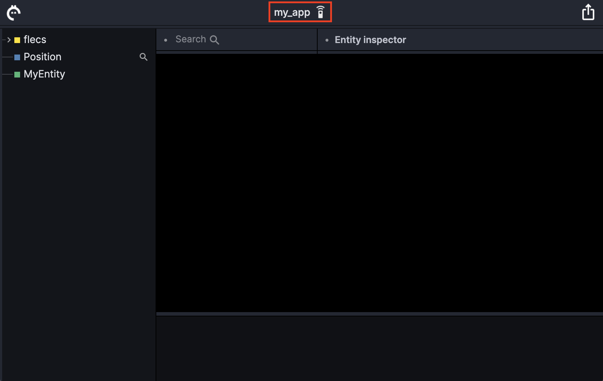

# REST API
This document provides an overview of the REST API. The Flecs REST API enables (web) clients to inspect the contents of the ECS store, by remotely running queries and requesting entities.

## Enable the REST API
The REST API can be enabled in an application by instantiating the `EcsRest`/`flecs::Rest` component:

```c
// Start REST API with default parameters
ecs_singleton_set(world, EcsRest, {0});
```
```cpp
// Start REST API with default parameters
world.set<flecs::Rest>({});
```

When an application uses the app addon [FLECS_APP](https://flecs.docsforge.com/master/api-app/) the REST interface can be enabled like this:

```c
// Start application main loop, enable REST interface
ecs_app_run(world, &(ecs_app_desc_t){
    .enable_rest = true
})
```
```cpp
// Start application main loop, enable REST interface
world.app().enable_rest().run();
```

To test if the REST API is working, navigate to http://localhost:27750/entity/flecs/core/World. Upon success this request should return a reply that looks like:
```json
{"path":"World", "ids":[["flecs.rest.Rest"], ["flecs.core.Identifier", "flecs.core.Name"], ["flecs.core.Identifier", "flecs.core.Symbol"], ["flecs.core.ChildOf", "flecs.core"], ["flecs.doc.Description", "flecs.core.Name"], ["flecs.doc.Description", "flecs.doc.Brief"]]}
```

For the full C/C++ API reference [see the REST addon documentation](https://flecs.docsforge.com/master/api-rest/).

## Explorer
An application with REST enabled can be remotely monitored with the [Flecs Explorer](https://github.com/flecs-hub/explorer). When the application is running with REST enabled, navigate to https://flecs.dev/explorer. This should connect the Explorer to the application.

When the connection is successful, the Explorer should look similar to this:



The remote icon next to the title should be visible. If the connection is not successful it could be that the explorer did not receive a response fast enough. To force the explorer to connect remotely, add `?remote=true` to the request: https://flecs.dev/explorer?remote=true.

If connection issues persist, the browser could be preventing connections to a local application. See the [Explorer repository README](https://github.com/flecs-hub/explorer) for more information on how to workaround this and other issues.

**Tip**: To show the application title in the explorer, pass the command line arguments to `ecs_init`/`flecs::world::world`:

```c
ecs_world_t *world = ecs_init_w_args(argc, argv);
```
```c++
flecs::world world(argc, argc);
```

## Endpoints
This section describes the endpoints of the REST API.

### entity
```
/entity/<path>
```
The entity endpoint requests data from an entity. The path is the entity
path or name of the entity to query for. The reply is formatted according to the [JSON serializer Entity](JsonFormat.md#entity) type.

The following parameters can be provided to the endpoint:

#### **path**
Add path (name) for entity.

**Default**: true

#### **label**
Add label (from doc framework) for entity.

**Default**: false

#### **id_labels**
Add labels (from doc framework) for (component) ids.

**Default**: false

#### **base**
Add base components.

**Default**: true

#### **values**
Add component values.

**Default**: false

#### **private**
Add private components.

**Default**: false

#### **type_info**
Add reflection data for component types.

**Default**: false

#### **Example**:
```
/entity/my_entity
/entity/my_entity?values=true
/entity/parent/child
```

### query
```
/query?q=<query>
```
The query endpoint requests data for a query. The implementation uses the
rules query engine. The reply is formatted as an [JSON serializer Iterator](JsonFormat.md#iterator) type.

The following parameters can be provided to the endpoint:

#### **term_ids**
Add top-level "ids" array with components as specified by query.

**Default**: true

#### **ids**
Add result-specific "ids" array with components as matched. Can be different from top-level "ids" array for queries with wildcards.

**Default**: true
  
#### **subjects**
Add result-specific "subjects" array with component source. A 0 element indicates the component is matched on the current (This) entity.

**Default**: true
    
#### **variables**
Add result-specific "variables" array with values for variables, if any.

**Default**: true
 
#### **is_set**
Add result-specific "is_set" array with boolean elements indicating whether component was matched (used for optional terms).

**Default**: true

#### **values**
Add result-specific "values" array with component values. A 0 element indicates a component that could not be serialized, which can be either
because no reflection data was registered, because the component has no
data, or because the query didn't request it.

**Default**: true

#### **entities**
Add result-specific "entities" array with matched entities.

**Default**: true

#### **entity_labels**
Include doc name for entities.

**Default**: false

#### **variable_labels**
Include doc name for variables.

**Default**: false

#### **duration**
Include measurement on how long it took to serialize result.

**Default**: false
    
#### **type_info**
Add top-level "type_info" array with reflection data on the type in
the query. If a query element has a component that has no reflection
data, a 0 element is added to the array.

**Default**: false

#### Example:
```
/query?q=Position
/query?q=Position&values=true
/query?q=Position%2CVelocity
```